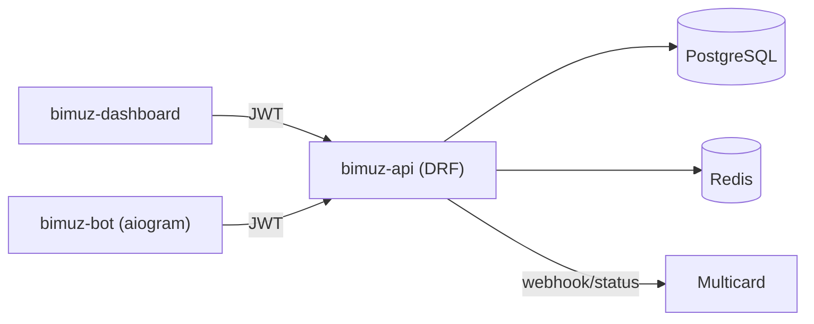
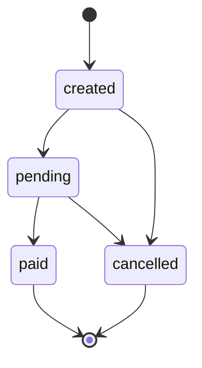
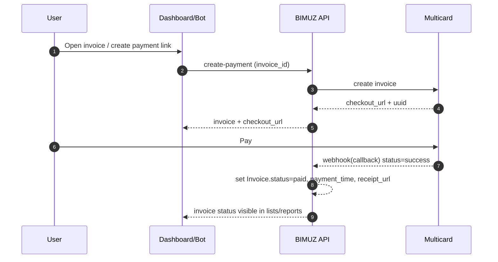
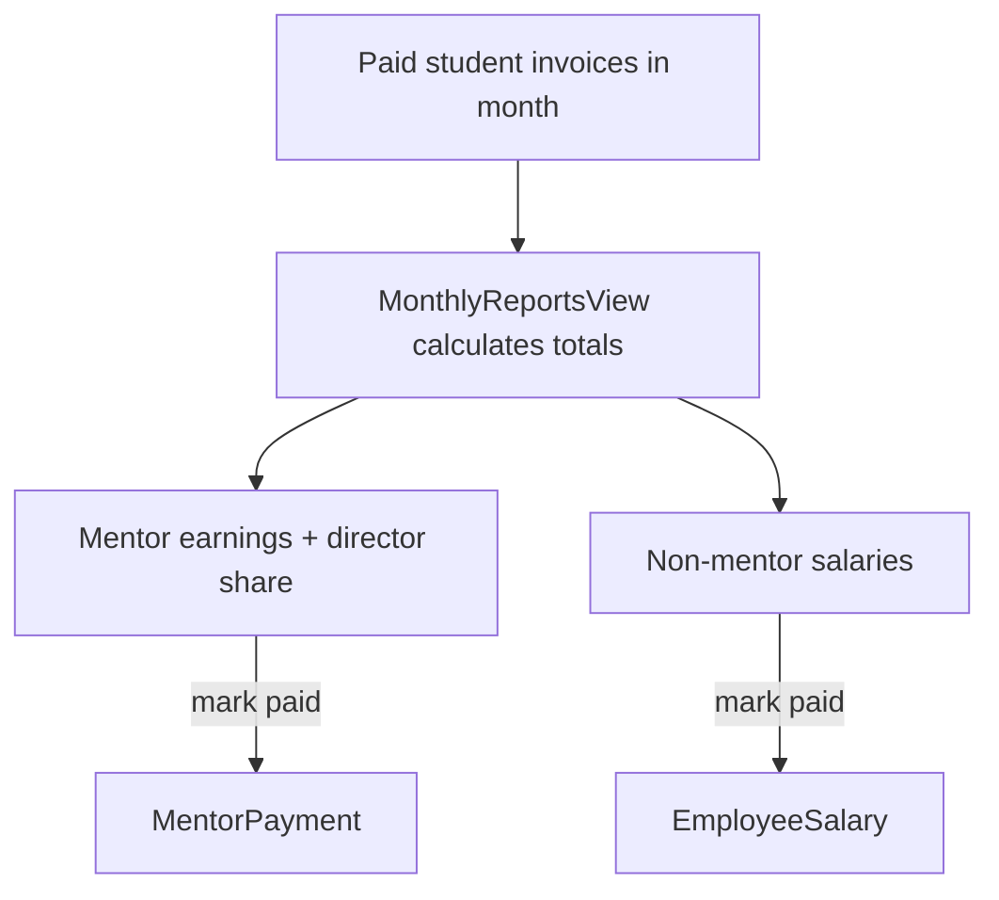

# BIMUZ API (Django REST Framework)

Backend for BIMUZ education management platform. **All sensitive logic (RBAC, financial calculations, “paid” flags, etc.) must be enforced here**. Frontend (`bimuz-dashboard`) and bot (`bimuz-bot`) are convenience layers only.

## Table of contents

- [System overview](#system-overview)
- [Core domain](#core-domain)
- [Role hierarchy (RBAC)](#role-hierarchy-rbac)
- [Payments (Invoices)](#payments-invoices)
- [Reports & Salaries](#reports--salaries)
- [Attendances](#attendances)
- [Local development](#local-development)
- [Environment variables](#environment-variables)
- [Deployment notes](#deployment-notes)

## System overview



## Core domain

- **Employee**: staff user with `role` (dasturchi/direktor/administrator/buxgalter/mentor/sotuv_agenti/assistent).
- **Student**: learner entity.
- **Group**: course group (schedule, price, seats, mentor, starting_date).
- **Invoice**: student payments for a group (Multicard integration + status).
- **Attendance**: daily attendance record (group/date/participants).
- **EmployeeSalary**: monthly salary for **non-mentor** employees.
- **MentorPayment**: monthly “paid” tracking for mentor earnings.

## Role hierarchy (RBAC)

Role levels (**higher = more privileged**):

1. `dasturchi` (Developer)
2. `direktor` (Director)
3. `administrator` (Administrator)
4. `buxgalter` (Accountant)
5. `mentor`, `sotuv_agenti`, `assistent` (Other)

**Important**:
- UI may show/hide buttons, but **backend must always validate permissions**.
- Reports/Salary payment operations are **restricted server-side**.

## Payments (Invoices)

Invoices represent **student payments** (installment/partial possible depending on backend rules).

### State transitions (simplified)



### How an invoice becomes paid



> Note: marking **student invoices** as “paid” manually should be treated as a **separate business decision** and kept tightly restricted. (Current strategy: “paid” flags are meant for staff salaries/mentor payments, not student invoices.)

## Reports & Salaries

### Reports visibility (consumer apps)
- Dashboard: **only** `dasturchi`, `direktor`, `administrator`, `buxgalter`
- Bot: **Reports are disabled** (no financial analytics via Telegram)

### Mentor earnings split rule (for every group)
- If group has **≤ 6 students**: Director 45% / Mentor 55%
- If group has **> 6 students**: Director 40% / Mentor 60%

### Director remaining funds
Director remaining is computed from monthly invoices:

\[
\text{director_remaining}=\max(0,\ \text{director_share_total}-\text{non_mentor_salaries_total})
\]

### “Paid” tracking (non-student payments)
- **EmployeeSalary.is_paid** + **payment_date** track salary payout for non-mentor staff.
- **MentorPayment.is_paid** + **payment_date** track mentor payout.
- Permission for marking these as paid: **only** `direktor` and `buxgalter`.



## Attendances

Backend provides attendance operations. Consumer rules:
- Everyone can **read** attendances.
- Mentors can create attendance for **their groups**.
- Higher roles (dasturchi/direktor/administrator) can create on behalf of a mentor (fallback scenario).

## Local development

Typical workflow:

```bash
cd bimuz-api
python -m venv venv
source venv/bin/activate
pip install -r requirements.txt
python manage.py migrate
python manage.py runserver 0.0.0.0:8000
```

If you changed models:

```bash
python manage.py makemigrations
python manage.py migrate
```

## Environment variables

This repo uses `.env` style configuration (see your infra setup). Common variables:

- **Database**: `DATABASE_URL` or `POSTGRES_*`
- **Redis**: `REDIS_URL`
- **Django**: `DJANGO_SECRET_KEY`, `DJANGO_DEBUG`, `ALLOWED_HOSTS`
- **Payments**: Multicard credentials + callback URLs

## Deployment notes

- Backend must be reachable by:
  - `bimuz-dashboard` (web)
  - `bimuz-bot` (Telegram bot server)
  - Multicard webhooks (public endpoint)
- Keep webhook endpoints behind HTTPS and validate signatures/secret where applicable.

---

Last updated: January 2026
